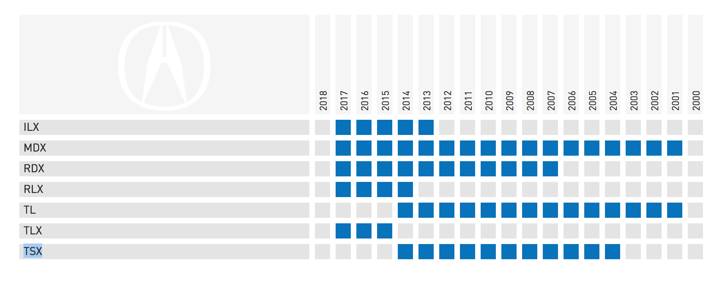

# Full-Stack Short test

This test will evaluate your front-end and back-end skills.

It will take at least 2 hours but no more than 4 to complete the test.

## Structure of the repository

```
.
├── Readme.md                           # Readme
├── back-end                            # Contain the back-end stack in various languages to create the api
│    ├── golang                         # stack in golang (Framework Gin)
│    ├── php                            # stack in PHP 7 (Framework Slim)
│    ├── python                         # stack in Python (Framework Flask/SqlAlchemy)
│    └── Readme.md                      # Back-End Readme
│
├── data                                # The data
│    ├── postman                        # Postman file (collection)
│    │      └── collection.json         # The postman collection of the back-end api
│    ├── mockup.png                     # Mockup of the UI to create
│    └── mpd.png                        # Structure of the database
│
├── database                            # The database in MySQL
│    ├── Readme.md                      # The readme explain how to run/stop/update the database
│    └── sql                            # Script to created the database, add fixtures,...
└── front-end                           # Stack of the Front-End (React.js)
```


## Front-End Tasks

* A single page "app" that displays years (Task #2) and vehicle models (Task #1) for the vehicle make "Acura" in a grid format. The data are coming from an API that you will develop (Back-End Tasks).
* A grid with the contents of `years` and `vehicle-models` (as in the mockup below).



* Set the corresponding box to be blue if the entry for that vehicle model and year exists. And grey if it doesn't exist. (An api call will be necessary Task #3)
* When clicking on a vehicle-model/year box, it is toggled and the visual displays the new state. (An api call will be necessary to be able to update the state in the database, Task #4)


## Back-End Tasks

Develop the following tasks in the language you prefer (PHP, Goland or Python). A stack is available for each of these languages in the folder `back-end`.


* TASK 1: As a user, I want to list all the vehicle model by vehicle make (Ex. Acura) to be able to define the row header of the grid
    - Implement a new endpoint to do this action

* TASK 2: As a user, I want to list all the vehicle years available to be able to define the column header of the grid
    - Implement a new endpoint to do this action

* TASK 3: As a user, I want to know the vehicle coverage by make/year/model to be able to fill up the grid with the correct colors.
    - Implement a new endpoint to do this action

* TASK 4: As a user, I want to be able to remove a vehicle from the coverage (model/year)
    - Update the database migration script `data/sql/update_database.sql` add a column `state` in all the tables existing. This column can take 2 values 0/1. (0 means the entry has been turn off)
    - Update the database migration script `data/sql/update_database.sql` add a column `updated` in all the tables existing. (This column contain the date and the time when the data has been changed)
    - Implement a new endpoint to do this action


## How to submit your work?

Create a zip file and send it by email.

## Evaluation

This will be evaluated on the compliance to the supplied visual (mockup.png), and the code quality.

You will have the opportunity to justify your decisions during the interview.
